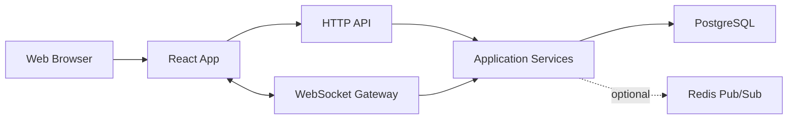
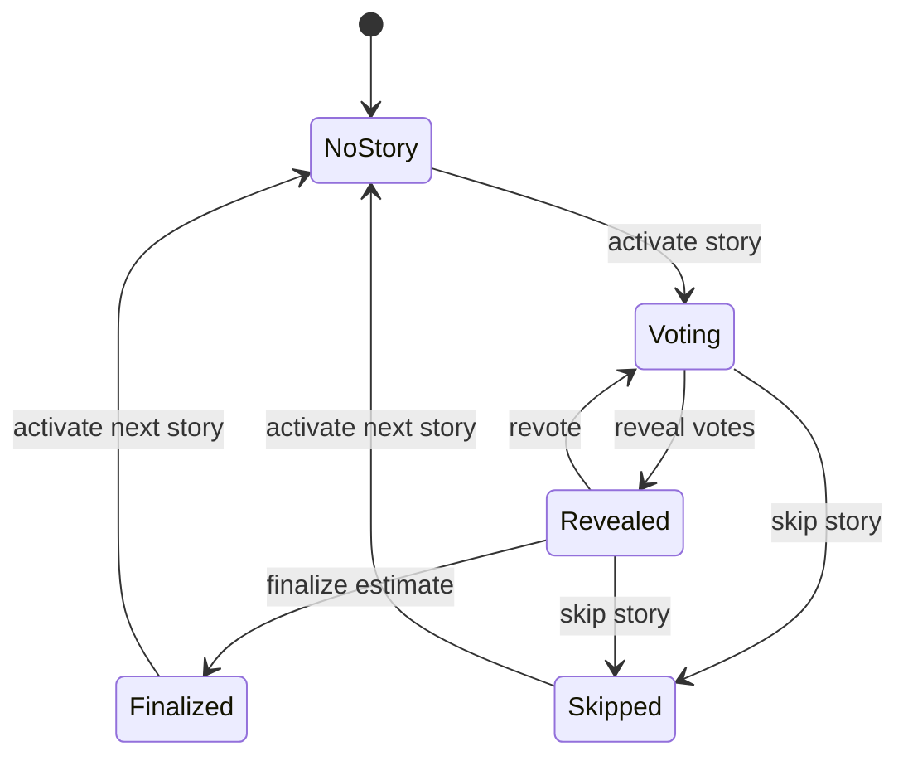

# Scrum Poking Game Technical Design

## 1. Overview

Scrum Poking Game is a real-time planning poker application for agile teams. A facilitator creates an estimation room, team members join from a link, everyone privately selects an estimate, and the room reveals all votes at the same time. The product should make refinement meetings faster, clearer, and lower-friction without requiring accounts for every participant.

This document defines an implementation-ready technical plan for the first production-grade version of the application.

## 2. Product Goals

- Let a facilitator create a planning poker room in under 30 seconds.
- Let participants join a room with a shareable link and display name.
- Support private voting, synchronized reveal, revote, and story progression.
- Preserve enough room history to review estimates after the meeting.
- Keep the architecture simple enough for a small team or solo maintainer to build and operate.

## 3. Non-Goals

- Full agile project management or backlog ownership.
- Jira, Linear, or GitHub issue sync in the first release.
- Enterprise SSO, organization management, or billing.
- Complex estimation analytics beyond basic voting summaries.
- Native mobile applications.

## 4. Assumptions

- The repository is starting from documentation and does not yet contain application code.
- "Poking" refers to a Scrum planning poker style estimation game.
- The first release should prioritize a web app with real-time collaboration.
- Anonymous participation should be supported, while facilitator accounts can be added later.
- Rooms are lightweight and can expire after a configured retention period.

## 5. Recommended Stack

The recommended MVP stack is intentionally boring and easy to deploy.

| Layer | Recommendation | Reason |
| --- | --- | --- |
| Frontend | React, TypeScript, Vite | Fast iteration, strong ecosystem, simple deployment |
| Styling | CSS Modules or Tailwind CSS | Consistent UI without heavy design-system overhead |
| Backend | Node.js, TypeScript, Fastify | Low ceremony HTTP server with good WebSocket support |
| Real-time | WebSocket via `@fastify/websocket` | Bidirectional updates for room state and votes |
| Persistence | PostgreSQL | Reliable relational model for rooms, stories, votes, and events |
| Cache/PubSub | Redis, optional for MVP | Needed when horizontally scaling WebSocket servers |
| Auth | Anonymous session cookie for MVP | Low-friction joins without account setup |
| Hosting | Render, Fly.io, Railway, or similar | Simple app plus Postgres deployment |

For a tiny first prototype, SQLite can replace PostgreSQL. For a production-oriented MVP, PostgreSQL should be used from the beginning to avoid migration churn.

## 6. Core Concepts

### Room

A room is the live estimation session. It has a facilitator, participants, a voting scale, a list of stories, and a current story.

### Participant

A participant is a person connected to a room. They may be a facilitator, voter, or observer. Participants can be anonymous and identified by a signed session token.

### Story

A story is the backlog item currently being estimated. It has a title, optional description, status, and estimate result.

### Vote

A vote is a private estimate submitted by a participant for a specific story. Votes are hidden until the facilitator reveals them.

### Voting Scale

A voting scale is the list of allowed estimate values. The default should be Fibonacci-like:

```text
0, 1, 2, 3, 5, 8, 13, 21, ?, coffee
```

The `?` card means "unknown" and `coffee` means "needs a break or discussion."

## 7. User Roles

| Role | Capabilities |
| --- | --- |
| Facilitator | Create room, edit stories, change current story, reveal votes, reset votes, finalize estimate, remove participants |
| Voter | Join room, update display name, vote on active story, change vote before reveal |
| Observer | Join room, watch state, cannot vote |

The MVP can make the room creator the only facilitator. Later versions can support facilitator handoff.

## 8. Main Workflows

### 8.1 Create Room

1. User opens the app.
2. User enters a room name or accepts a generated one.
3. User chooses a voting scale or accepts the default.
4. Backend creates a room and facilitator participant.
5. Frontend opens the room page and displays a shareable link.

### 8.2 Join Room

1. Participant opens a room link.
2. Participant enters display name.
3. Participant chooses voter or observer if enabled.
4. Backend creates or resumes a participant session.
5. Participant receives current room state over WebSocket.

### 8.3 Estimate Story

1. Facilitator creates or selects a story.
2. Room enters `voting` state.
3. Participants privately select cards.
4. Room shows who has voted, but not vote values.
5. Facilitator reveals votes.
6. Room shows vote values and summary.
7. Facilitator finalizes estimate or starts a revote.

### 8.4 Revote

1. Facilitator clicks reset or revote.
2. Existing votes are archived or marked superseded.
3. Room returns to `voting` state.
4. Participants submit fresh votes.

### 8.5 End Session

1. Facilitator reviews completed stories.
2. Facilitator copies or downloads summary.
3. Room remains available until retention expiry.

## 9. Functional Requirements

### Room Management

- Create a room with a generated short code.
- Join a room by short code or share URL.
- Support room names.
- Support room expiry.
- Support copying room invite link.
- Support participant reconnect.

### Participant Management

- Require a display name before joining.
- Show online and offline participants.
- Allow display name edits.
- Allow facilitator to remove a participant.
- Track participant role.

### Story Management

- Create story with title and optional description.
- Edit story while it is not finalized.
- Delete story if it has no finalized estimate.
- Move to next and previous story.
- Mark story as skipped, estimated, or active.

### Voting

- Let each voter choose one card per active story.
- Hide vote values until reveal.
- Show vote completion status before reveal.
- Reveal all votes at the same time.
- Allow revote after reveal.
- Allow facilitator to finalize an estimate.

### Summary

- Show count, average, median, min, max, and distribution for numeric votes.
- Exclude non-numeric cards from numeric aggregates.
- Show non-numeric vote counts separately.
- Allow copying session summary as Markdown.

### Accessibility

- All card buttons must be keyboard accessible.
- Vote state must not rely on color alone.
- Focus should move predictably after joining, voting, revealing, and resetting.
- Use semantic buttons, headings, labels, and live regions for major room state changes.

## 10. Non-Functional Requirements

| Area | Requirement |
| --- | --- |
| Latency | Vote and reveal updates should reach connected clients within 300 ms under normal network conditions |
| Availability | MVP target is best-effort uptime with graceful room recovery after server restart |
| Security | Room access requires unguessable room codes or signed invite tokens |
| Privacy | Votes are private until reveal and should not be sent to clients before reveal |
| Scalability | Single instance should support at least 100 active rooms and 1,000 connected participants |
| Compatibility | Latest stable Chrome, Firefox, Safari, and Edge |
| Observability | Structured logs for room lifecycle, errors, and WebSocket disconnects |

## 11. Architecture



### 11.1 Frontend Responsibilities

- Render lobby, room, voting, reveal, and summary screens.
- Hold local UI state such as selected card before submission.
- Maintain WebSocket connection and reconnect automatically.
- Render server-authoritative room state.
- Avoid deriving sensitive hidden votes from local state.

### 11.2 Backend Responsibilities

- Own all room, participant, story, and vote state.
- Validate every command.
- Store durable room history.
- Broadcast sanitized room snapshots.
- Keep hidden votes off the wire before reveal.
- Handle participant reconnect and stale connection cleanup.

### 11.3 Persistence Responsibilities

- Store rooms, participants, stories, votes, and room events.
- Enforce uniqueness where useful, such as room code and one active vote per participant per story round.
- Support audit/debug history through append-only events.

## 12. Data Model

### 12.1 Tables

```sql
CREATE TABLE rooms (
  id UUID PRIMARY KEY,
  code TEXT NOT NULL UNIQUE,
  name TEXT NOT NULL,
  voting_scale JSONB NOT NULL,
  status TEXT NOT NULL,
  current_story_id UUID NULL,
  created_at TIMESTAMPTZ NOT NULL,
  expires_at TIMESTAMPTZ NOT NULL
);

CREATE TABLE participants (
  id UUID PRIMARY KEY,
  room_id UUID NOT NULL REFERENCES rooms(id),
  display_name TEXT NOT NULL,
  role TEXT NOT NULL,
  session_hash TEXT NOT NULL,
  online BOOLEAN NOT NULL DEFAULT FALSE,
  joined_at TIMESTAMPTZ NOT NULL,
  last_seen_at TIMESTAMPTZ NOT NULL
);

CREATE TABLE stories (
  id UUID PRIMARY KEY,
  room_id UUID NOT NULL REFERENCES rooms(id),
  title TEXT NOT NULL,
  description TEXT NULL,
  status TEXT NOT NULL,
  final_estimate TEXT NULL,
  sort_order INTEGER NOT NULL,
  created_at TIMESTAMPTZ NOT NULL,
  updated_at TIMESTAMPTZ NOT NULL
);

CREATE TABLE vote_rounds (
  id UUID PRIMARY KEY,
  room_id UUID NOT NULL REFERENCES rooms(id),
  story_id UUID NOT NULL REFERENCES stories(id),
  status TEXT NOT NULL,
  round_number INTEGER NOT NULL,
  revealed_at TIMESTAMPTZ NULL,
  created_at TIMESTAMPTZ NOT NULL
);

CREATE TABLE votes (
  id UUID PRIMARY KEY,
  round_id UUID NOT NULL REFERENCES vote_rounds(id),
  participant_id UUID NOT NULL REFERENCES participants(id),
  value TEXT NOT NULL,
  created_at TIMESTAMPTZ NOT NULL,
  updated_at TIMESTAMPTZ NOT NULL,
  UNIQUE (round_id, participant_id)
);

CREATE TABLE room_events (
  id UUID PRIMARY KEY,
  room_id UUID NOT NULL REFERENCES rooms(id),
  actor_participant_id UUID NULL REFERENCES participants(id),
  type TEXT NOT NULL,
  payload JSONB NOT NULL,
  created_at TIMESTAMPTZ NOT NULL
);
```

### 12.2 Status Values

Room status:

- `open`
- `ended`
- `expired`

Story status:

- `pending`
- `active`
- `estimated`
- `skipped`

Vote round status:

- `voting`
- `revealed`
- `cancelled`

Participant role:

- `facilitator`
- `voter`
- `observer`

## 13. API Design

### 13.1 HTTP Endpoints

| Method | Path | Purpose |
| --- | --- | --- |
| `POST` | `/api/rooms` | Create room |
| `GET` | `/api/rooms/:code` | Get public room metadata |
| `POST` | `/api/rooms/:code/join` | Join room and create participant session |
| `POST` | `/api/rooms/:code/summary` | Generate or retrieve room summary |
| `GET` | `/healthz` | Health check |

HTTP should be used for initial setup and non-real-time actions. Room actions after join should use WebSocket commands so all clients receive ordered state changes.

### 13.2 WebSocket Connection

Path:

```text
/ws/rooms/:code
```

Authentication:

- Client sends signed participant session token in cookie or connection init message.
- Server validates token and maps connection to participant.

### 13.3 Client to Server Commands

| Command | Role | Payload |
| --- | --- | --- |
| `participant.updateName` | Any participant | `{ "displayName": "Ana" }` |
| `story.create` | Facilitator | `{ "title": "...", "description": "..." }` |
| `story.update` | Facilitator | `{ "storyId": "...", "title": "...", "description": "..." }` |
| `story.activate` | Facilitator | `{ "storyId": "..." }` |
| `story.skip` | Facilitator | `{ "storyId": "..." }` |
| `vote.cast` | Voter | `{ "roundId": "...", "value": "5" }` |
| `vote.reveal` | Facilitator | `{ "roundId": "..." }` |
| `vote.reset` | Facilitator | `{ "storyId": "..." }` |
| `estimate.finalize` | Facilitator | `{ "storyId": "...", "estimate": "5" }` |
| `room.end` | Facilitator | `{}` |

### 13.4 Server to Client Events

| Event | Purpose |
| --- | --- |
| `room.snapshot` | Full sanitized room state after connect or reconnect |
| `room.updated` | Incremental room state update |
| `participant.joined` | Participant joined |
| `participant.left` | Participant went offline |
| `story.updated` | Story list or active story changed |
| `vote.statusUpdated` | Voted/not-voted status changed |
| `vote.revealed` | Vote values are now visible |
| `error` | Command rejected or server error |

### 13.5 Sanitized Room Snapshot

Before reveal, vote values must not be included. The server should send only participant vote status.

```json
{
  "room": {
    "code": "ABCD12",
    "name": "Payments Refinement",
    "status": "open",
    "votingScale": ["0", "1", "2", "3", "5", "8", "13", "21", "?", "coffee"],
    "currentStoryId": "story-1"
  },
  "participants": [
    {
      "id": "participant-1",
      "displayName": "Ana",
      "role": "facilitator",
      "online": true,
      "hasVoted": true
    }
  ],
  "stories": [
    {
      "id": "story-1",
      "title": "Add saved cards",
      "description": null,
      "status": "active",
      "finalEstimate": null
    }
  ],
  "activeRound": {
    "id": "round-1",
    "status": "voting",
    "votes": []
  }
}
```

After reveal, vote values can be included.

```json
{
  "activeRound": {
    "id": "round-1",
    "status": "revealed",
    "votes": [
      {
        "participantId": "participant-1",
        "value": "5"
      }
    ],
    "summary": {
      "numericCount": 1,
      "average": 5,
      "median": 5,
      "min": 5,
      "max": 5,
      "distribution": {
        "5": 1
      },
      "nonNumeric": {}
    }
  }
}
```

## 14. Room State Machine



Rules:

- Only one story can be active per room.
- Only one vote round can be active per active story.
- A participant can cast or update their vote only while the active round is in `voting`.
- Hidden vote values are stored server-side and excluded from broadcasts until `revealed`.
- Finalizing an estimate requires the active round to be `revealed`.

## 15. Validation Rules

- Room name: 1 to 80 characters.
- Display name: 1 to 40 characters.
- Story title: 1 to 160 characters.
- Story description: max 2,000 characters.
- Vote value: must exist in the room voting scale.
- Room code: generated by server, at least 6 characters, collision checked.
- Facilitator-only commands must verify participant role on the server.
- Expired or ended rooms reject mutating commands.

## 16. Security Design

### 16.1 Room Access

- Generate room codes with enough entropy to prevent casual guessing.
- Prefer 8 to 10 characters using a non-ambiguous alphabet.
- Rate-limit join attempts by IP and room code.

### 16.2 Participant Sessions

- Set a signed, HTTP-only session cookie after join.
- Store only a hash of the session token in the database.
- Rotate token if participant changes role.

### 16.3 Vote Privacy

- Never send hidden vote values to clients before reveal.
- Do not include hidden votes in logs.
- Keep vote reveal as a server-side state transition, not a client-side UI toggle.

### 16.4 Input Safety

- Escape all rendered user-generated content.
- Validate all command payloads with a schema library such as Zod.
- Limit payload sizes for WebSocket messages.
- Avoid accepting raw HTML in names, story titles, or descriptions.

## 17. Frontend Screens

### Home

- Create room form.
- Optional room name input.
- Voting scale selector.

### Join Room

- Display room name.
- Display name input.
- Join as voter button.
- Join as observer option if enabled.

### Room

- Header with room name, copy invite link, connection status.
- Story panel with current story and controls for facilitator.
- Voting cards.
- Participant list with voted status.
- Reveal and reset controls for facilitator.
- Vote summary after reveal.
- Story queue and completed estimates.

### Summary

- Completed story list.
- Final estimates.
- Vote distributions.
- Copy as Markdown action.

## 18. UI Behavior

- The selected card should be visually distinct and announced to screen readers.
- Before reveal, participant rows should show `Voted` or `Waiting`.
- After reveal, participant rows should show vote values.
- Facilitator controls should be disabled while commands are in flight.
- Reconnect banner should appear if the WebSocket disconnects.
- If the participant reconnects, the client should request a fresh room snapshot.

## 19. Error Handling

| Scenario | Behavior |
| --- | --- |
| Room not found | Show a join error with a link to create a new room |
| Room expired | Show read-only expired room summary if available |
| WebSocket disconnected | Keep current state, show reconnecting indicator, retry with backoff |
| Command rejected | Show inline error and keep previous server state |
| Duplicate participant name | Allow it, but distinguish users by stable participant id |
| Facilitator disconnects | Room remains active; controls return when facilitator reconnects |

## 20. Testing Strategy

### Unit Tests

- Vote summary calculations.
- State machine transitions.
- Command validation.
- Room code generation.
- Permission checks.

### Integration Tests

- Create and join room.
- Cast hidden votes and verify snapshots exclude values before reveal.
- Reveal votes and verify all clients receive values.
- Revote and verify old votes are not counted.
- Finalize estimate and verify story status.

### End-to-End Tests

Use Playwright for browser-level coverage:

- Facilitator creates room and copies link.
- Two participants join and vote.
- Facilitator reveals votes.
- Facilitator finalizes estimate.
- Participant refreshes and sees current room state.

### Load Testing

For the first production launch:

- 100 rooms with 10 participants each.
- Burst vote submissions within 5 seconds.
- Reveal events across all rooms.
- WebSocket reconnect storm simulation.

## 21. Observability

### Logs

Use structured JSON logs with:

- `requestId`
- `roomId`
- `participantId`
- `eventType`
- `durationMs`
- `errorCode`

Do not log vote values until after reveal. Even after reveal, logs should prefer counts and metadata over raw participant votes.

### Metrics

- Active rooms.
- Active WebSocket connections.
- Join failures.
- Command rejection counts.
- Vote reveal latency.
- WebSocket reconnect count.
- Room creation count.

### Alerts

- Health check failure.
- Database connection failure.
- High WebSocket disconnect rate.
- Error rate above threshold.

## 22. Deployment Plan

### Environments

- `local`: developer machine.
- `preview`: per-branch deployment if hosting provider supports it.
- `production`: public app.

### Configuration

Required environment variables:

```text
DATABASE_URL=
SESSION_SECRET=
APP_BASE_URL=
ROOM_RETENTION_DAYS=30
NODE_ENV=production
```

Optional environment variables:

```text
REDIS_URL=
LOG_LEVEL=info
SENTRY_DSN=
```

### Database Migrations

- Use a migration tool such as Prisma Migrate, Drizzle Kit, or node-pg-migrate.
- Migrations must run before app startup in deployment.
- Seed data should be local-only.

## 23. Scaling Plan

### MVP

- One Node.js app instance.
- One PostgreSQL database.
- In-memory connection registry.

### Horizontal Scale

When running multiple app instances:

- Store room state in PostgreSQL.
- Use Redis Pub/Sub to broadcast room events across instances.
- Use sticky WebSocket sessions if supported by the platform.
- Ensure every command writes to the database before broadcasting.

### Future Scale

- Split frontend static hosting from backend API.
- Add read replicas only if summaries or history reads become heavy.
- Add archival cleanup job for expired rooms.

## 24. Implementation Plan

### Phase 1: Project Foundation

- Set up TypeScript monorepo or single app workspace.
- Add frontend and backend packages.
- Add linting, formatting, and tests.
- Add local Docker Compose for PostgreSQL.
- Add health check endpoint.

### Phase 2: Room Lifecycle

- Create room API.
- Join room API.
- Participant session cookie.
- Room page shell.
- WebSocket connect and room snapshot.

### Phase 3: Story and Voting

- Story CRUD for facilitator.
- Active story state.
- Vote casting.
- Hidden vote status.
- Reveal votes.
- Reset votes.

### Phase 4: Summary and Polish

- Vote aggregation.
- Final estimate.
- Session summary.
- Copy Markdown summary.
- Accessibility pass.
- Browser E2E tests.

### Phase 5: Production Readiness

- Database migrations.
- Structured logging.
- Rate limiting.
- Error tracking.
- Deployment configuration.
- Load smoke test.

## 25. Acceptance Criteria

The first production-ready release is complete when:

- A facilitator can create a room and share an invite link.
- At least two participants can join from separate browsers.
- Votes stay hidden until reveal.
- Reveal updates all connected participants without refresh.
- Revote clears active votes and accepts new ones.
- Finalized estimates appear in a session summary.
- Refreshing the page restores the current room state.
- Basic keyboard navigation works for joining, voting, revealing, and resetting.
- Automated tests cover the core voting state machine and real-time reveal flow.

## 26. Open Questions

- Should the facilitator be allowed to transfer ownership?
- Should room links be public by code only, or require a longer signed invite token?
- Should observers be enabled in the first release?
- Should story import from CSV or plain text be included in MVP?
- How long should room history be retained?
- Should estimates support custom labels such as T-shirt sizes?

## 27. Future Enhancements

- Jira, Linear, GitHub Issues, and Trello integrations.
- Facilitator accounts and saved room templates.
- Team workspaces.
- Custom voting scales.
- Timer and discussion phases.
- Emoji reactions or confidence votes.
- Export to CSV.
- Mobile-optimized facilitator mode.
- AI-generated meeting summary from completed estimates and discussion notes.

## 28. Decision Log

| Date | Decision | Rationale |
| --- | --- | --- |
| 2026-06-15 | Use WebSockets for live room updates | Voting and reveal flows need bidirectional low-latency updates |
| 2026-06-15 | Keep hidden vote values server-side until reveal | Protects vote privacy and avoids client-side leaks |
| 2026-06-15 | Recommend PostgreSQL for MVP persistence | Provides durable room history and easy relational constraints |
| 2026-06-15 | Support anonymous participant sessions first | Reduces meeting friction and keeps first release focused |

